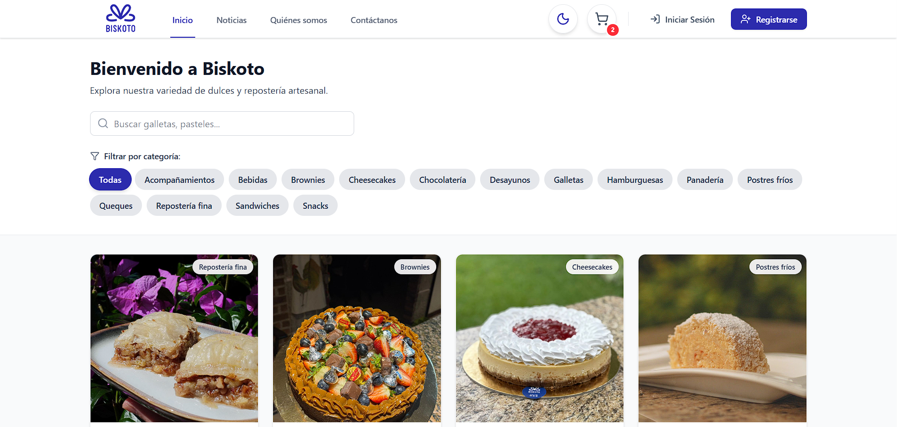
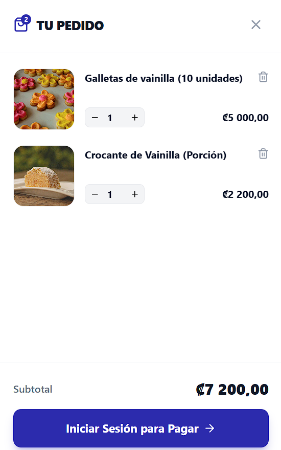
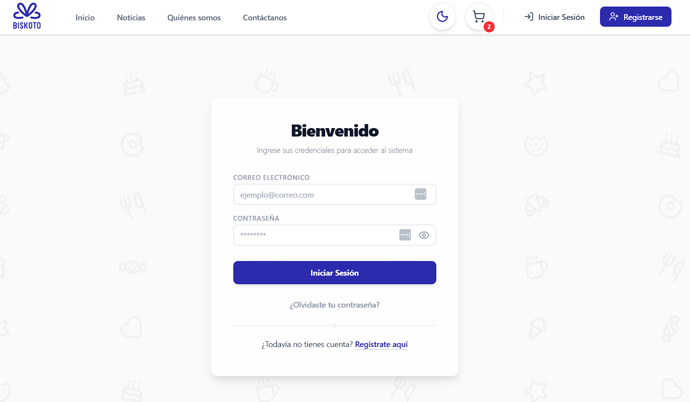
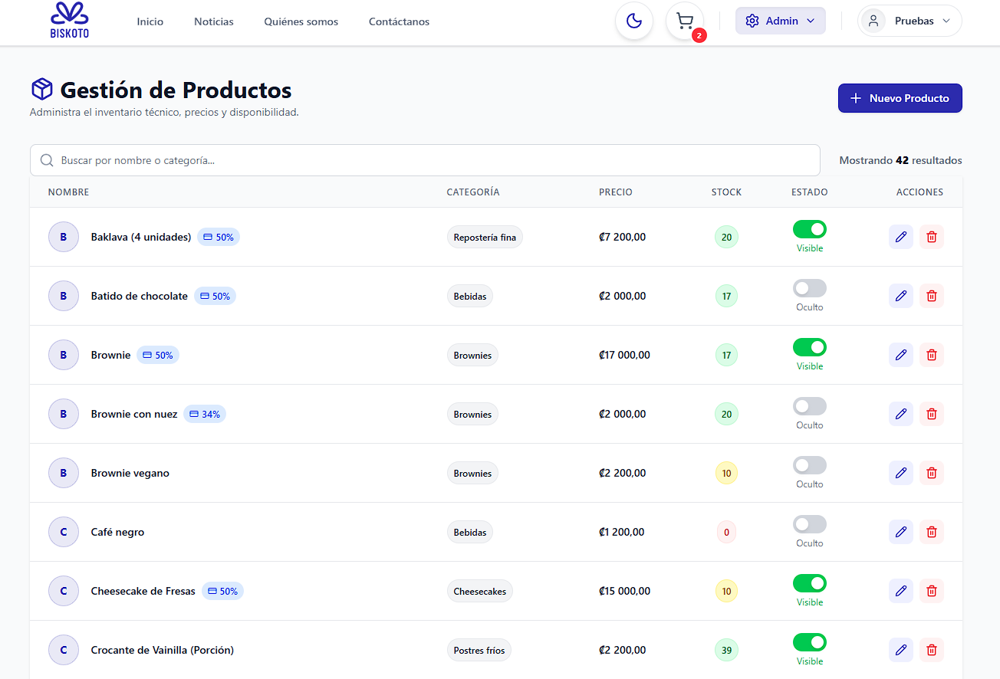

<div align="center">

  

  **Plataforma de comercio electrónico para repostería artesanal**

  Gestiona productos, pedidos, inventario y clientes en una experiencia moderna y fluida.

  <br />

  
  
  
  
  
  

  <br />

  [](https://biskoto-ecommerce.vercel.app)

  <br />

  [Funcionalidades](#funcionalidades) · [Arquitectura](#arquitectura) · [Inicio Rápido](#inicio-rápido) · [Capturas](#capturas-de-pantalla)

</div>

<br />

---

<br />

## 🍪 ¿Qué es Biskoto?

**Biskoto** es una solución de e-commerce diseñada para negocios de repostería artesanal. Permite a los clientes explorar el catálogo, gestionar su carrito y realizar pedidos, mientras que los administradores controlan el inventario, productos, ingredientes, proveedores y el flujo completo de ventas, todo desde una interfaz moderna con soporte de modo oscuro.

<br />

## Funcionalidades

<table>
<tr>
<td width="50%">

### Para Clientes
- Explorar el **catálogo de productos** con imágenes y precios
- Gestión de **carrito** con validación de stock en tiempo real
- **Perfil de usuario** con historial de pedidos
- Sistema de **autenticación** seguro con recuperación de contraseña
- Soporte de **modo oscuro / claro**

</td>
<td width="50%">

### Para Administradores
- **Panel de administración** con CRUD completo
- Gestión de **productos**, **categorías** e **ingredientes**
- Control de **inventario** y **proveedores**
- Administración de **usuarios** y roles
- Procesamiento y seguimiento de **compras**

</td>
</tr>
</table>

<br />

### 🔐 Sistema de Autenticación

| Característica | Descripción |
|:---|:---|
| **Registro seguro** | Gestionado por Supabase Auth |
| **Sesiones JWT** | Tokens con refresco automático |
| **Roles** | Cliente · Administrador |
| **Rutas protegidas** | Acceso restringido según permisos |
| **Recuperación de contraseña** | Flujo completo por correo electrónico |

<br />

---

<br />

## 🏗️ Arquitectura

```
biskoto-ecommerce/
│
├── frontend/                         # Aplicación React + Vite
│   └── src/
│       ├── api/                      # Servicios de comunicación con el backend
│       │   ├── axiosConfig.js
│       │   ├── authService.js
│       │   └── productoService.js
│       ├── assets/                   # Imágenes, logo e íconos
│       ├── components/               # Componentes reutilizables de UI
│       │   ├── Navbar.jsx
│       │   ├── CartDrawer.jsx
│       │   └── IconBackground.jsx
│       ├── context/                  # Estado global
│       │   ├── AuthContext.jsx
│       │   └── CartContext.jsx
│       ├── pages/
│       │   ├── admin/                # Panel de administración
│       │   ├── auth/                 # Login, Registro, Recuperación
│       │   ├── home/                 # Página principal
│       │   ├── shop/                 # Detalle de producto
│       │   └── user/                 # Perfil del usuario
│       └── App.jsx                   # Enrutamiento principal
│
├── backend/                          # API REST con Express
│   └── src/
│       ├── config/
│       │   └── supabase.js           # Cliente Supabase
│       ├── controllers/              # Lógica de negocio
│       ├── middleware/               # Autenticación y validación
│       └── routes/                   # Definición de endpoints
│
├── database/                         # Scripts SQL
│   ├── schema.sql
│   ├── seed.sql
│   └── auth_trigger.sql
│
└── docs/screenshots/                 # Capturas de pantalla
```

<br />

### Stack Tecnológico

<table>
<tr>
<td align="center" width="33%">
<br />

**Frontend**

<br />

| Tecnología | Uso |
|:---:|:---|
| React | Interfaz de usuario |
| Vite | Build & Dev Server |
| Tailwind CSS | Sistema de diseño |
| React Router | Navegación SPA |
| Context API | Estado global |

</td>
<td align="center" width="33%">
<br />

**Backend**

<br />

| Tecnología | Uso |
|:---:|:---|
| Node.js | Runtime |
| Express | Framework HTTP |
| Supabase | Base de datos (PostgreSQL) |
| JWT | Autenticación |
| Axios | Cliente HTTP |

</td>
<td align="center" width="33%">
<br />

**Servicios**

<br />

| Tecnología | Uso |
|:---:|:---|
| Supabase Auth | Autenticación |
| Supabase Storage | Almacenamiento de imágenes |
| Vercel | Despliegue del frontend |
| Render | Despliegue del backend |

</td>
</tr>
</table>

<br />

---

<br />

## 🚀 Inicio Rápido

### Prerrequisitos

| Software | Versión mínima |
|:---|:---|
| [Node.js](https://nodejs.org/) | `v18+` |
| [Git](https://git-scm.com/) | cualquier versión reciente |
| Cuenta en [Supabase](https://supabase.com/) | — |

<br />

<details>
<summary><strong>1. Clonar el repositorio</strong></summary>

<br />

```bash
git clone https://github.com/DanielAR27/biskoto-ecommerce.git
cd biskoto-ecommerce
```

</details>

<details>
<summary><strong>2. Configurar variables de entorno</strong></summary>

<br />

**`backend/.env`**
```env
PORT=3000
SUPABASE_URL=tu_url_de_supabase
SUPABASE_KEY=tu_anon_key
SUPABASE_SERVICE_ROLE_KEY=tu_service_role_key
```

**`frontend/.env`**
```env
VITE_API_URL=http://localhost:3000/api
VITE_SUPABASE_URL=tu_url_de_supabase
VITE_SUPABASE_ANON_KEY=tu_anon_key
```

</details>

<details>
<summary><strong>3. Levantar el backend</strong></summary>

<br />

```bash
cd backend
npm install
npm run dev
```

> El servidor se ejecutará en `http://localhost:3000`

</details>

<details>
<summary><strong>4. Levantar el frontend</strong></summary>

<br />

```bash
cd frontend
npm install
npm run dev
```

> La aplicación estará disponible en `http://localhost:5173`

</details>

<br />

---

<br />

## 📸 Capturas de pantalla

Las capturas se encuentran en la carpeta [`docs/screenshots/`](docs/screenshots/).

<br />

<div align="center">

### 🏠 Inicio

Página principal con el catálogo de productos destacados, navegación y carrito lateral.



<br />

---

### 🛍️ Catálogo de Productos

Vista del catálogo con tarjetas de producto, precios y control de disponibilidad de stock en tiempo real.


<br />

---

### 🛒 Carrito de Compras

Carrito lateral con resumen de productos, cantidades, validación de stock y total de compra.



<br />

---

### 🔑 Autenticación

Páginas de login y registro con soporte de modo oscuro y recuperación de contraseña por correo.



<br />

---

### 🛠️ Panel de Administración

Panel completo con gestión CRUD de productos, ingredientes, proveedores, categorías y usuarios.



</div>

<br />

---

<br />

## 🌐 Demo en producción

| | |
|:---|:---|
| **Frontend** | [biskoto-ecommerce.vercel.app](https://biskoto-ecommerce.vercel.app) |
| **Backend** | Render (Node.js + Express) |
| **Base de datos** | Supabase (PostgreSQL) |

<br />

---

<br />

## 📄 Licencia

Este proyecto se distribuye bajo la licencia [MIT](LICENSE).

<br />

---

<br />

<div align="center">

  Hecho por **Luis Meza** y **Daniel Alemán**

  <sub>© 2025 Biskoto · Proyecto académico</sub>

</div>
